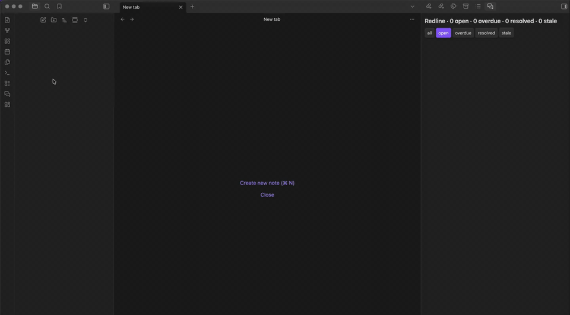

# Redline

Add PR-style review comments to any document in your Obsidian vault. Anchor comments to specific paragraphs, headings, list items, images, code blocks, callouts, or tables — your source documents stay clean because comments live in a sibling `.review.md` sidecar file.

## Demo



## Why

Obsidian is great for writing long documents collaboratively (with yourself, your future self, or external tools), but it has no built-in equivalent to a GitHub pull-request review. This plugin adds that workflow:

1. Read a document.
2. Drop comments where something needs to change.
3. Hand the document plus its `.review.md` sidecar to any tool — a human, a script, an AI assistant — that can act on the comments.
4. The tool resolves each comment by editing the source doc and flipping the comment status in the sidecar.

The plugin is intentionally protocol-based: it stores comments in a documented markdown sidecar format and does not bind to any specific downstream tool. Anything that can read markdown can participate.

## Features

- **Add review comment** on any paragraph, heading, list item, image, code block, callout, or table.
- **Block-reference anchoring**: comments are pinned to Obsidian's native `^blockref` markers, so they survive document reflow.
- **Markdown rendered comment bodies** in both the sidebar cards and the editor hover tooltip — bold, links, lists, code spans, inline images all just work.
- **Edit existing comments** from the sidebar; **Cmd/Ctrl+Enter** saves the modal.
- **Hover anywhere in the anchored block** to see the comment as a tooltip (paragraph-wide, code-block-wide, table-wide, callout-wide).
- **Per-comment due dates** with an **overdue** indicator (red border, dot, and an "overdue" sidebar filter).
- **Gutter markers** in the editor: amber for `open`, gray for `resolved`, red for `stale` or `overdue`.
- **Review sidebar** for the active document with filters (all / open / overdue / resolved / stale), jump-to-anchor, edit, toggle status, reattach, and delete.
- **Cross-doc dashboard** lists every `.review.md` in the vault with per-doc open / stale / overdue counts, sortable columns, and click-through to the source doc.
- **Stale anchor detection + Reattach** — if the anchor block is edited away, the comment is flagged stale; saved anchor context lets you reattach with one click.
- **Source-doc rename / move / delete are mirrored** on the sidecar so reviews follow the document around (toggle in settings).
- **Jump to next open comment** — keyboard-friendly navigation through unresolved items.
- **Per-document or central-folder sidecar storage** (settings).

## Installation

### From the Obsidian community catalog (once published)

Settings → Community plugins → Browse → search "Redline" → Install → Enable.

### Manual install

1. Build (or download a release):
   ```bash
   git clone <this-repo>
   cd redline
   npm install
   npm run build
   ```
2. Copy `manifest.json`, `main.js`, and `styles.css` to `<vault>/.obsidian/plugins/redline/`.
3. Reload Obsidian → Settings → Community plugins → enable "Redline".

## Usage

### Add a comment

1. Place your cursor on a paragraph (or select within it), or click an image/code-block/heading/etc.
2. Open the command palette (`Cmd/Ctrl + P`) → **Redline: Add comment at cursor**.
3. Type your comment (markdown is supported). Optionally pick a due date. Press **Cmd/Ctrl+Enter** to save.

The plugin will:
- Inject a `^blockref` anchor on the target block if it doesn't have one (reusing an existing anchor when present).
- Create (or update) `<doc>.review.md` next to your document.
- Show an amber gutter dot next to the anchored line and a card in the sidebar.

### Open the review sidebar

Click the speech-bubble ribbon icon on the left, or run **Redline: Toggle sidebar**.

### Open the cross-doc dashboard

Click the layout-dashboard ribbon icon, or run **Redline: Open dashboard**. You get a sortable table of every doc that has open / stale / overdue comments — click a row to jump into that doc.

### Resolve, edit, reattach a comment

In the sidebar:
- **Resolve / Reopen** — flips status between `open` and `resolved`.
- **Edit** — open the modal again to update the body or due date.
- **Reattach** — only shown for stale comments; uses the saved anchor context to find the original line and re-injects a fresh anchor.

### Hand off to a downstream tool

The `<doc>.review.md` sidecar is a plain, documented markdown file. Any tool you trust to edit your documents — a script, an AI assistant, a coworker — can read the open comments and apply the requested changes.

## Settings

- **Sidecar location** — alongside the source doc (default) or in a central `_reviews/` folder.
- **Central folder name** — vault-relative folder used when central layout is selected.
- **Mirror source-doc lifecycle** — when on (default), renaming, moving, or deleting a source doc also renames/moves/deletes its sidecar.

## Commands

| Command | What it does |
|---|---|
| Redline: Add comment at cursor | Create a new comment anchored to the current block. |
| Redline: Toggle sidebar | Show/hide the review sidebar on the right. |
| Redline: Open dashboard | Open the cross-doc dashboard tab. |
| Redline: Jump to next open comment | Move the cursor to the next unresolved comment in the active doc. |

## Development

```bash
npm install
npm run dev       # watch mode
npm run build     # production build
npm test          # vitest unit tests for parser + block-id logic
```

Tests cover the sidecar parser/serializer round-trip and the block-id injection logic. UI components are verified manually inside Obsidian.

## License

MIT — see [LICENSE](LICENSE).
